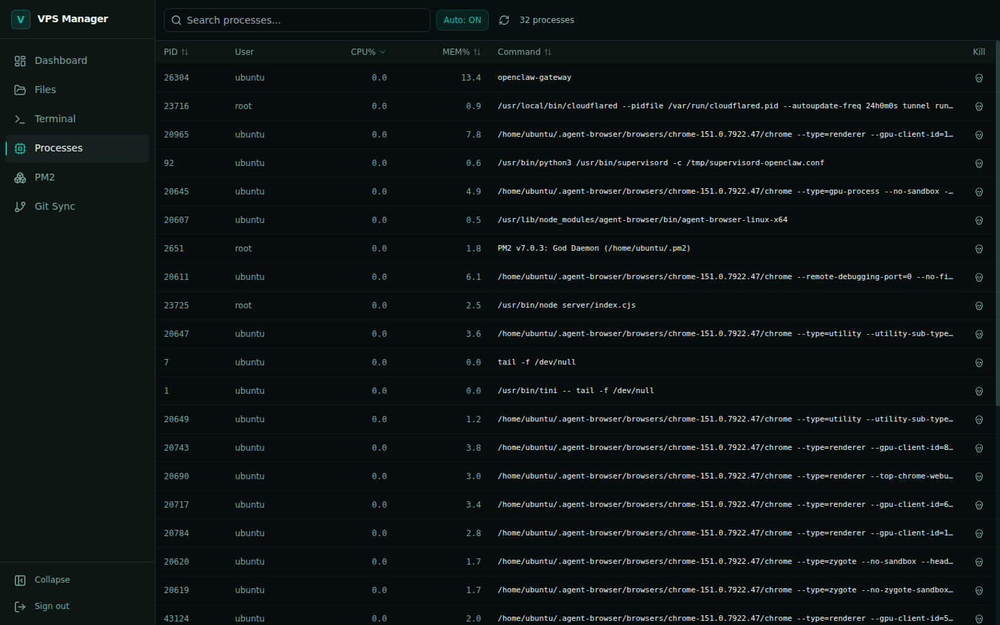

<div align="center">

# VPS Manager

**A self-hosted control panel for managing a Linux VPS from the browser.**

System monitoring · file management · web terminal · process control · PM2 orchestration · Git sync

[](./LICENSE)
[](#development)
[](#requirements)

### Built with

[](https://react.dev)
[](https://www.typescriptlang.org)
[](https://vite.dev)
[](https://tailwindcss.com)

[](https://nodejs.org)
[](https://expressjs.com)
[](https://socket.io)
[](https://pm2.keymetrics.io)

[](https://codemirror.net)
[](https://xtermjs.org)
[](https://git-scm.com)
[](https://systemd.io)

</div>

---

## Table of contents

- [Overview](#overview)
- [Screenshots](#screenshots)
- [Features](#features)
- [Architecture](#architecture)
- [Requirements](#requirements)
- [Installation](#installation)
- [Configuration](#configuration)
- [Running in production](#running-in-production)
- [Security model](#security-model)
  - [Sessions](#sessions)
- [API reference](#api-reference)
- [Development](#development)
- [Troubleshooting](#troubleshooting)
- [License](#license)

---

## Overview

VPS Manager is a single-tenant web control panel for a Linux server. It replaces the
common loop of *SSH in → run `htop` → `cd` around → `pm2 list` → `git pull`* with one
authenticated interface.

It is deliberately **single-user**: one password, one operator. There are no user
accounts, roles, or teams. That keeps the security surface small and the UI honest —
every control on screen acts on the machine immediately.

It is also **host-agnostic**. Paths, the effective user, the SSH identity, the init
system and PM2's home directory are all detected at boot rather than hard-coded, so
the panel behaves correctly whether it runs as `root` on Debian or as a normal user
on Ubuntu.

---

## Screenshots

### Dashboard

Live CPU, memory, disk and load metrics over a WebSocket. Metric tiles stay neutral
until a threshold is crossed (70 % warning, 90 % critical), so an idle server is calm
and a struggling one is obvious. Charts auto-scale to the observed data window rather
than a fixed 0–100 range.


### File manager

Browse, edit, upload, download, rename, copy and delete. Directory downloads are
streamed as ZIP archives. Every file type gets its own icon and hue — a `.json`
does not look like a `.js`, and `package.json` does not look like any other JSON
file — so a directory is scannable at a glance. The address bar works like Windows
Explorer: click the breadcrumb (or press `Ctrl+L`) to type or paste a path directly.


On a phone the same list folds size and modified time into a secondary line, since
there is no room for columns, and the toolbar collapses to New / Upload with
everything else behind an overflow sheet.


### Code editor

CodeMirror 6 with on-demand grammars for ~40 languages, find and replace, code
folding, bracket matching, autocomplete, adjustable font size, word wrap and
optional auto-save. `Ctrl+S` (or `Cmd+S`) saves; `Ctrl+Enter` also works, because it
is easier to reach on a phone.


The editor is genuinely usable on mobile, which was the point of moving off Monaco.
CodeMirror is `contenteditable`-based, so the OS provides native selection handles,
caret dragging and IME instead of fighting a hidden textarea. The key bar along the
bottom supplies the characters a phone keyboard hides — tab, braces, brackets,
pipe, `$`, backtick — plus undo and redo.


### Terminal

Full PTY-backed terminal via `node-pty` and CodeMirror-era xterm.js, rebuilt for
phones as well as desktops: multiple sessions, split panes, scrollback search,
and a mobile key bar for the keys a virtual keyboard cannot produce.


On mobile, sticky `Ctrl`/`Alt` modifiers apply to the phone's own keyboard as
well as the bar's buttons, so `Ctrl`+`C` actually interrupts a running process.
The bar tracks the visual viewport, so it stays above the on-screen keyboard
instead of being pushed underneath it.


### Processes

Sortable live process table with CPU/memory thresholds and signal-aware process
termination.



### PM2

Start, stop, restart, reload, delete and inspect PM2 applications. Logs stream over
WebSocket into a single docked panel rather than expanding inline under each card.
Stopped applications show `—` for CPU, memory and uptime instead of counting upward
from a stale `pm_uptime`.


Boot persistence is reported as three separate facts, because "will my app come back
after a reboot?" is three questions and conflating them is how processes get lost:
whether the PM2 daemon starts at boot, whether the process list has been saved, and
whether an individual app restarts on crash. The panel reads PID 1 directly rather
than trusting `pm2 startup`, which reports success on hosts where it does nothing.

The **New application** wizard walks from folder → script → options → review. Only the
name is required; memory limits, scheduled restarts, node arguments and environment
variables live behind an *Advanced* drawer that shows a count when anything inside it
is set.

<p align="center">
  
</p>

### Git sync

Manage repositories on disk: stage, commit, pull, push, branch, tag, stash and resolve
merges. Connects to GitHub over a generated deploy key and can auto-restart PM2 apps
when code updates.


### Mobile

Every section is a first-class mobile view — no horizontal scrolling at 390 px.

<p align="center">
  
  
  
</p>

---

## Features

<details open>
<summary><strong>Sessions &amp; sign-in</strong></summary>

- **Stay signed in for 30 days** — tokens renew silently in the background, so a
  long editing session is never interrupted by an expiry
- Renewal also fires on tab focus and network recovery, which is what makes a
  closed laptop lid or a sleeping phone survive the gap
- Rotating refresh tokens in an `httpOnly` cookie, hashed at rest, with replay
  detection and server-side revocation — see [Sessions](#sessions)
- Sign out ends the session on the server and across every open tab

</details>

<details open>
<summary><strong>System monitoring</strong></summary>

- Live CPU, memory, disk and network throughput pushed over Socket.IO
- Rolling 60-sample history with auto-scaled sparklines
- Load average shown against core count, flagged when sustained
- Grouped system actions: **Inspect** (read-only), **Maintain** (safe), **Restart services** (interrupting)

</details>

<details open>
<summary><strong>File management</strong></summary>

- Path-jailed browsing across allow-listed roots
- List and grid views, sortable by name, size, type or modified time
- **Per-type file icons** with distinct glyph *and* hue for every language family,
  plus exact-filename overrides (`package.json`, `Dockerfile`, `.gitignore`, lock files)
- **Editable address bar** — click the breadcrumb or press `Ctrl+L` to type or paste a path
- **OpenClaw workspace auto-detection** — scans the allowed roots for `.openclaw`
  installs and ranks them by content, instead of hard-coding one user's home
- CodeMirror 6 editing with on-demand grammars for ~40 languages
- Mobile-first editor: native selection, key bar, adjustable font, word wrap,
  optional auto-save, find and replace
- Inline preview for images (zoom/rotate), audio, video and PDF
- Multi-file upload (100 MB per file) with real progress, plus drag and drop
- ZIP directory download
- Copy, move, rename, delete, create file/folder, hidden-file toggle
- Range select with shift-click; keyboard shortcuts for copy, cut, paste, delete,
  select-all, filter and refresh

</details>

<details open>
<summary><strong>Terminal</strong></summary>

- Real PTY sessions with multiple concurrent tabs and desktop split panes
- Sessions spawn in the effective user's real home directory
- Shell environment is isolated from the panel's own config, so `PASSWORD`,
  `JWT_SECRET` and `PORT` never leak into a session
- Mobile key bar: `Ctrl`, `Alt`, `Esc`, `Tab`, arrows, `^C`/`^D`/`^L` and shell
  punctuation, on a 44px touch grid
- Sticky modifiers shared with the device keyboard, so `Ctrl`+`C` works when the
  letter is typed on the phone rather than tapped in the bar
- Keyboard-aware layout via the VisualViewport API
- Scrollback search, adjustable text size, quick-command palette
- WebGL rendering with automatic canvas fallback
- Live tab titles from the shell's own OSC title, plus reconnect/exit states
- Automatic fit/resize propagation to the server
- Web-link detection

</details>

<details open>
<summary><strong>Process control</strong></summary>

- Live `ps`-backed table, sortable on PID, CPU, memory and command
- Threshold colouring for CPU/memory pressure
- Signal selection when terminating

</details>

<details open>
<summary><strong>PM2 orchestration</strong></summary>

- Full lifecycle: start, stop, restart, reload, delete, flush, reset
- **Four-step "new app" wizard** — folder → script → options → review, with directory
  browsing and detected project files. Only the name is required; memory limits,
  scheduled restarts, node arguments and environment variables sit behind an
  *Advanced* drawer that reports how many are set
- Live log streaming into one docked panel, with search and filtering
- **Honest boot persistence** — reports whether the daemon starts at boot, whether the
  process list is saved, and whether each app restarts on crash, as three separate
  facts. Reads PID 1 rather than trusting `pm2 startup`, and lists apps that are
  running but missing from the saved dump
- Per-app metrics, `save` / `resurrect` support; stopped apps report `—` rather than
  counting uptime upward from a stale timestamp

</details>

<details open>
<summary><strong>Git synchronisation</strong></summary>

- Repository discovery with status, branch and commit history
- Stage, commit, pull, push, discard, checkout
- Branch and tag create/delete, stash push/pop
- Merge with conflict status and abort
- GitHub setup via generated SSH deploy key
- Background sync daemon with per-repo enable/disable

</details>

<details open>
<summary><strong>Interface</strong></summary>

- **Signature footer** on every page, and in the sidebar rail on the full-height
  Terminal and Files views where a footer below the pane would break the layout
- **Version and host in the sidebar**, so what is actually deployed is on screen
  rather than requiring a shell. The version is injected from `package.json` at
  build time — it cannot drift from the release that shipped
- **Two-column sign-in** on desktop stating what the panel manages, collapsing to
  a compact header on mobile where a marketing column would only be an obstacle
- Accent colour is interaction-only; semantic colours are reserved for state

</details>

---

## Architecture

```
┌──────────────────────────────────────────────────────────────┐
│  Browser                                                     │
│  React 18 · TypeScript · Tailwind · Vite                     │
│  Route-level code splitting (React.lazy)                     │
└───────────────┬──────────────────────────┬───────────────────┘
                │ REST (bearer, auto-renewed)  │ Socket.IO (token handshake)
┌───────────────▼──────────────────────────▼───────────────────┐
│  Express server  (server/index.cjs)                          │
│  helmet · rate limiting · path jail · audit log              │
├──────────────────────────────────────────────────────────────┤
│  node-pty      │  PM2 CLI   │  git CLI   │  fs / os          │
└──────────────────────────────────────────────────────────────┘
```

**Stack**

| Layer | Technology |
|---|---|
| UI | React 18, React Router 7, Tailwind CSS 3 |
| Editor / terminal | CodeMirror 6, xterm.js 5 |
| Build | Vite 6, TypeScript 5.6 |
| Server | Express 4, Socket.IO 4 |
| Process/PTY | node-pty, PM2 |
| Security | helmet, express-rate-limit, jsonwebtoken |

**Frontend layout**

```
src/
├── components/     Layout shell, Footer, Git-sync wizard,
│                   CodeEditor / FileEditor / FilePreview, files/FileRow
├── lib/            api.ts (fetch + 401 replay), auth.ts (token lifecycle),
│                   socket.ts, utils.ts, toast.tsx,
│                   fileTypes.ts, editorTheme.ts, editorLanguages.ts
├── pages/          Dashboard, FileManager, Terminal, Processes,
│                   PM2Manager, GitSync, Login
├── index.css       Design tokens + component primitives
└── App.tsx         Auth gate, error boundary, toast provider, lazy routes
```

**Server layout**

```
server/
├── index.cjs       Routes, Socket.IO, PTY, auth middleware
├── platform.cjs    Boot-time host detection (user, homes, init system, PM2_HOME)
├── sessions.cjs    Refresh-token store: rotation, reuse detection, revocation
└── sessions.json   Hashed refresh tokens, mode 0600, gitignored
```

Pages are lazy-loaded, so xterm and the heavier managers are fetched only when their
route is visited. The editor is split out again below the route: browsing a folder
costs ~53 KB, and CodeMirror is only downloaded when you actually open a file.
Language grammars load individually on demand, so editing a `.sh` file never fetches
the TypeScript parser.

---

## Requirements

| Requirement | Version | Notes |
|---|---|---|
| Node.js | ≥ 18 (22 LTS recommended) | Required by `node-pty` and `archiver` |
| npm | ≥ 9 | |
| PM2 | latest | `npm install -g pm2` — needed for the PM2 section |
| Git | ≥ 2.30 | Needed for the Git Sync section |
| Build toolchain | `build-essential`, `python3` | `node-pty` compiles native bindings |

On Debian/Ubuntu:

```bash
sudo apt update && sudo apt install -y build-essential python3 git
npm install -g pm2
```

---

## Installation

**1 — Clone**

```bash
git clone https://github.com/siam38/VPS-Manger.git
cd VPS-Manger
```

**2 — Install dependencies**

```bash
npm install
```

> **Note**
> If `NODE_ENV=production` is exported in your shell, npm will silently skip
> devDependencies and the build will fail with `vite: not found`. Install with:
> ```bash
> NODE_ENV=development npm install --include=dev
> ```

**3 — Configure** — create `.env` in the project root (see [Configuration](#configuration)).

**4 — Build the frontend**

```bash
npm run build
```

**5 — Start**

```bash
npm start
```

Open `http://<server-ip>:48292` and sign in with your `PASSWORD`.

---

## Configuration

Create `.env` in the project root:

```env
PORT=48292
PASSWORD=change_this_to_a_long_random_password
JWT_SECRET=change_this_to_a_long_random_secret
```

| Variable | Required | Default | Description |
|---|---|---|---|
| `PORT` | no | `48292` | Listening port |
| `PASSWORD` | **yes** | — | Sign-in password. The server refuses to start without it. |
| `JWT_SECRET` | **yes** | — | Signing key for session tokens. Rotating it invalidates all sessions. |

Generate strong values:

```bash
openssl rand -base64 32   # PASSWORD
openssl rand -hex 48      # JWT_SECRET
```

**Filesystem access** is restricted to an allow-list defined in `server/index.cjs`:

```js
const ALLOWED_BASES = ['/root', '/var/www', '/home', '/opt', '/tmp'];
```

Every path is resolved and verified against these roots, so `../` traversal outside them
is rejected. Edit this list to widen or tighten access.

---

## Running in production

### With PM2

```bash
pm2 start server/index.cjs --name vps-manager
pm2 save
pm2 startup          # run the printed command to persist across reboots
```

### Behind Nginx with TLS

The panel speaks plain HTTP and ships no certificates by design. **Terminate TLS in
front of it.** WebSocket upgrade headers are required or the terminal and live metrics
will not connect.

```nginx
server {
    listen 443 ssl http2;
    server_name panel.example.com;

    ssl_certificate     /etc/letsencrypt/live/panel.example.com/fullchain.pem;
    ssl_certificate_key /etc/letsencrypt/live/panel.example.com/privkey.pem;

    location / {
        proxy_pass http://127.0.0.1:48292;
        proxy_http_version 1.1;

        # Required for Socket.IO
        proxy_set_header Upgrade    $http_upgrade;
        proxy_set_header Connection "upgrade";

        proxy_set_header Host              $host;
        proxy_set_header X-Real-IP         $remote_addr;
        proxy_set_header X-Forwarded-For   $proxy_add_x_forwarded_for;
        proxy_set_header X-Forwarded-Proto $scheme;

        proxy_read_timeout 86400;   # keep long-lived terminals alive
    }
}
```

Then close the raw port:

```bash
sudo ufw deny 48292
sudo ufw allow 443/tcp
```

A tunnel (Cloudflare Tunnel, Tailscale) works equally well and avoids exposing a public
port at all.

---

## Security model

**What is implemented**

- **Password authentication** with timing-safe comparison
- **Persistent sessions** — a short-lived access token (15 min) paired with a
  long-lived refresh token held in an `httpOnly`, `SameSite=Strict` cookie.
  The browser renews silently in the background, so an active session never
  interrupts you to retype the password. See [Sessions](#sessions).
- **Refresh token rotation** with reuse detection — each refresh invalidates the
  previous token, and replaying a spent one revokes the entire token family
- **Server-side revocation** — signing out invalidates the session on the server,
  not just in the browser
- **Login rate limiting** plus per-IP lockout after repeated failures, with automatic expiry
- **Path jail** — all filesystem operations resolve against `ALLOWED_BASES`
- **`helmet`** security headers
- **Audit log** (`server/audit.log`) recording auth attempts, file operations and system actions
- **No credentials in URLs** — downloads authenticate via the `Authorization` header, so tokens never reach access logs or `Referer`

**What you must provide**

| Risk | Mitigation |
|---|---|
| Plain HTTP exposes the password and token | Terminate TLS in a reverse proxy or tunnel |
| Panel reachable from the internet | Firewall the port; expose only through the proxy |
| Full shell access by design | Treat the password as root-equivalent; use a long random value |
| Access token stored in `localStorage` | Vulnerable to XSS, but expires in 15 minutes. The durable credential is the `httpOnly` refresh cookie, which JavaScript cannot read. Still, do not run untrusted third-party scripts on this origin. |

### Sessions

Earlier versions issued a single 30-minute JWT and never renewed it. Half an hour
into editing a file, the next save returned 401 and dropped you back at the login
form — mid-edit, with unsaved work. That is fixed.

| | Access token | Refresh token |
|---|---|---|
| Lifetime | 15 minutes | 30 days |
| Stored in | `localStorage` (readable by scripts) | `httpOnly` cookie (**not** readable by scripts) |
| Sent as | `Authorization: Bearer` header | Automatically, to `/api` only |
| Rotates | On every renewal | On every use |

The browser renews at ~80% of the access token's lifetime, and again whenever the
tab regains focus or the network returns — background timers are throttled in
hidden tabs and frozen on sleeping phones, so a timer alone would not survive a
closed laptop lid. If a request still returns 401, the client refreshes once and
replays it; concurrent 401s share a single refresh rather than stampeding.

The practical effect: **you stay signed in for 30 days without retyping the
password**, and long editing sessions are never interrupted. What an attacker
could lift from `localStorage` now expires in fifteen minutes.

Refresh tokens are stored only as SHA-256 hashes in `server/sessions.json`
(mode `0600`), so the file is not a set of usable credentials if it leaks. Sessions
survive a server restart. Rotation makes replay detectable: presenting an
already-spent token outside a short grace window revokes every token descended
from that login.

`POST /api/logout` revokes server-side. To end **every** session on all devices
— after exposing the password, for example — call `POST /api/sessions/revoke-all`,
or simply delete `server/sessions.json` and restart.

> **Warning**
> This panel grants terminal access to the host. Anyone who obtains the password
> effectively has the privileges of the user running the server. Never expose it
> directly to the public internet without TLS and network restrictions.

**Dependency status.** `npm audit` reports 2 high advisories, both in
`react-router`'s RSC server mode, which this SPA does not use — they are not reachable
here. Every version at or below 7.17.0 carries a *reachable* open-redirect/XSS pair
instead, so 7.18.1 is the safest available target. Running `npm audit fix --force` will
downgrade you into the exploitable versions — don't.

The `archiver` transitive chain is patched through pinned `overrides` in `package.json`
(`brace-expansion`, `minimatch`, `glob`) rather than a major bump, because `archiver` 8
is ESM-only and the server is CommonJS.

---

## API reference

All routes require `Authorization: Bearer <token>` except `POST /api/login` and
`POST /api/refresh` (which authenticates via the refresh cookie instead, since it
must work when the access token has already expired).

<details>
<summary><strong>Auth</strong></summary>

| Method | Endpoint | Description |
|---|---|---|
| `POST` | `/api/login` | Exchange password for an access token; sets the refresh cookie |
| `GET` | `/api/verify` | Validate the current access token |
| `POST` | `/api/refresh` | Rotate the refresh cookie and issue a fresh access token |
| `POST` | `/api/logout` | Revoke this session server-side and clear the cookie |
| `GET` | `/api/sessions` | List active sign-ins |
| `POST` | `/api/sessions/revoke-all` | Sign out every device |

</details>

<details>
<summary><strong>System</strong></summary>

| Method | Endpoint | Description |
|---|---|---|
| `GET` | `/api/system/info` | Host, platform, CPU model, uptime, IP |
| `GET` | `/api/system/stats` | Point-in-time CPU/memory/disk/network |
| `POST` | `/api/system/action/:action` | Run a maintenance or restart action |
| `GET` | `/api/audit/logs` | Read the audit trail |

</details>

<details>
<summary><strong>Files</strong></summary>

| Method | Endpoint | Description |
|---|---|---|
| `GET` | `/api/files/list` | Directory listing |
| `GET` | `/api/files/content` | Read a file |
| `GET` | `/api/files/download` | Download file, or directory as ZIP |
| `POST` | `/api/files/save` | Write a file |
| `POST` | `/api/files/upload` | Multipart upload |
| `POST` | `/api/files/mkdir` · `/rename` · `/copy` | Create, rename, copy |
| `DELETE` | `/api/files/delete` | Delete |

</details>

<details>
<summary><strong>Processes &amp; PM2</strong></summary>

| Method | Endpoint | Description |
|---|---|---|
| `GET` | `/api/processes/list` | Running processes |
| `POST` | `/api/processes/kill` | Send a signal |
| `GET` | `/api/pm2/list` | PM2 applications |
| `GET` | `/api/pm2/app-detail/:name` · `/logs/:name` · `/monit/:name` | Inspect |
| `POST` | `/api/pm2/restart` · `/reload` · `/delete` · `/flush` · `/reset` | Lifecycle |
| `GET` | `/api/pm2/browse-dirs` | Directory picker for the new-app wizard |

</details>

<details>
<summary><strong>Git</strong></summary>

| Method | Endpoint | Description |
|---|---|---|
| `GET` | `/api/git/repos` · `/status` · `/info` · `/log` · `/diff` | Inspect |
| `POST` | `/api/git/stage` · `/commit` · `/pull` · `/push` · `/discard` · `/checkout` | Core workflow |
| `GET`/`POST` | `/api/git/branches` · `/branch/create` · `/branch/checkout` · `/branch/delete` | Branches |
| `GET`/`POST`/`DELETE` | `/api/git/tags` · `/tag/create` · `/tag` | Tags |
| `GET`/`POST` | `/api/git/stash/list` · `/stash` · `/stash/pop` | Stashes |
| `GET`/`POST` | `/api/git/merge/status` · `/merge` · `/merge/abort` | Merges |
| `GET`/`POST` | `/api/git/github/*` | Deploy-key setup, connection test, clone |
| `GET`/`POST`/`DELETE` | `/api/git/sync/config` · `/sync/status` | Sync daemon |

</details>

<details>
<summary><strong>WebSocket events</strong></summary>

| Event | Direction | Purpose |
|---|---|---|
| `stats:subscribe` / `stats:unsubscribe` | client → server | Toggle the live metric stream |
| `stats:update` | server → client | Metric payload |
| `terminal:create` / `input` / `resize` / `destroy` | client → server | PTY lifecycle |
| `terminal:data` | server → client | PTY output |
| `pm2:logs:subscribe` / `unsubscribe` | client → server | Toggle log streaming |

</details>

---

## Development

```bash
NODE_ENV=development npm install --include=dev

npm run server     # API + WebSocket on :48292
npm run dev        # Vite dev server with HMR, proxied to the API
```

Vite proxies `/api` and `/socket.io` to port 48292, so both run side by side.

| Script | Purpose |
|---|---|
| `npm run dev` | Frontend dev server with hot reload |
| `npm run server` | Backend only |
| `npm run build` | Production build to `dist/` |
| `npm run preview` | Serve the production build locally |

**Type checking.** Vite does not type-check during build, so run it explicitly:

```bash
npx tsc --noEmit
```

**Design tokens.** Colours, type scale and radii live in `tailwind.config.js`;
component primitives (`.card`, `.btn`, `.pill`, `.row`, `.field`, `.empty`) live in
`src/index.css`. Prefer these over ad-hoc utility strings so restyling stays global.

---

## Troubleshooting

| Symptom | Cause | Fix |
|---|---|---|
| `vite: not found` during build | `NODE_ENV=production` made npm skip devDependencies | `NODE_ENV=development npm install --include=dev` |
| Server exits with `PASSWORD environment variable is required` | Missing or unreadable `.env` | Create `.env` in the project root |
| Terminal never connects | Proxy is dropping the WebSocket upgrade | Add `Upgrade` / `Connection` headers to the proxy config |
| Metrics frozen after re-login | Stale socket from the previous session | Fixed in current versions; hard-refresh if it recurs |
| `node-pty` fails to install | Missing native build toolchain | `apt install build-essential python3` |
| PM2 section empty | PM2 not installed for the server's user | `npm install -g pm2` and confirm `pm2 list` works as that user |
| Locked out after failed logins | Per-IP lockout triggered | Wait for expiry, or restart the server to clear it |
| Signed out again after ~15 minutes | The refresh cookie is not reaching the server | It is scoped to `/api` and `SameSite=Strict`. Confirm the proxy forwards cookies and does not strip `Set-Cookie`, and that the panel is reached on one consistent origin |
| Signed out after switching between `http://` and `https://` | The cookie's `Secure` flag follows the protocol it was issued on | Use one origin — sign in again on the one you intend to keep using |
| Everyone signed out after a redeploy | `JWT_SECRET` changed, invalidating access tokens | Keep `JWT_SECRET` stable across deploys; sessions themselves survive restarts |
| Want to force sign-out everywhere | Password exposed, or a device lost | `POST /api/sessions/revoke-all`, or delete `server/sessions.json` and restart |

---

## License

MIT — see [LICENSE](./LICENSE).

<div align="center">
<sub>Built by <a href="https://github.com/siam38">Siam</a></sub>
</div>
