# 🦊 Fox VPS Manager

A self-hosted control panel for a Linux server. It replaces the usual loop —
SSH in, run `htop`, `cd` around, `pm2 list`, `git pull` — with one authenticated
page you can drive from a phone.

It is single-user on purpose: one password, one operator, no roles or teams. That
keeps the security surface small and the interface honest, because every control
on screen acts on the machine immediately.

It is also host-agnostic. Paths, the effective user, the SSH identity, the init
system and PM2's home directory are detected at boot rather than hard-coded, so
it behaves correctly whether it runs as `root` on Debian or as an unprivileged
user on Ubuntu.

**Requirements:** Node 18+ (22 LTS recommended), npm 9+, git. PM2 and a build
toolchain if you want the PM2 section and native `node-pty`.

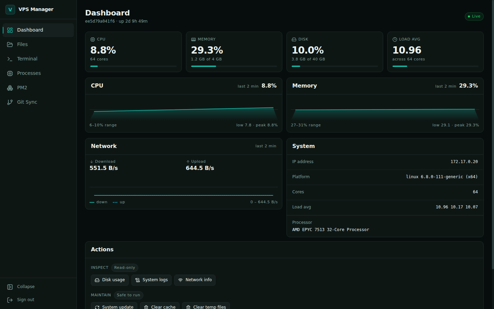

---

## Install

```bash
git clone https://github.com/siam38/VPS-Manger.git
cd VPS-Manger
NODE_ENV=development npm install --include=dev
```

The explicit `NODE_ENV` matters. If `NODE_ENV=production` is exported in your
shell — common on a server — npm silently skips devDependencies, and the build
then dies with `vite: not found`.

Create `.env` in the project root:

```env
PORT=48292
PASSWORD=a_long_random_password
JWT_SECRET=a_long_random_secret
```

```bash
openssl rand -base64 32   # PASSWORD
openssl rand -hex 48      # JWT_SECRET
```

Then build and start:

```bash
npm run build
npm start
```

Open `http://<server-ip>:48292` and sign in.

| Variable | Required | Default | Notes |
|---|---|---|---|
| `PORT` | no | `48292` | Listening port |
| `PASSWORD` | **yes** | — | The server refuses to boot without it |
| `JWT_SECRET` | **yes** | — | Changing it invalidates every access token |

Filesystem access is confined to an allow-list in `server/index.cjs`:

```js
const ALLOWED_BASES = ['/root', '/var/www', '/home', '/opt', '/tmp'];
```

Every path is resolved and checked against those roots, so `../` traversal out of
them is rejected. Edit the list to widen or tighten reach.

---

## Updating

The panel updates itself. It talks to the GitHub API over anonymous HTTPS and
nothing else — no token is ever stored on a VPS, no SSH key is involved, and it
does not touch your git remote. Any box with outbound 443 can update.

From **Settings**, the panel shows the new version, the commits since yours
grouped by type, and three choices: install, snooze, or skip. Snooze and skip are
stored on the server, so dismissing on your phone is honoured on the desktop.

### What happens when you click install

The order is deliberate — everything that can fail is done *before* the running
panel is touched:

1. **Refuse on a dirty tree.** Local edits are never silently eaten.
2. **Back up** the current install.
3. **Download and build** into a staging directory. The live panel is untouched,
   so a broken build or a bad dependency costs nothing.
4. **Boot the staged build on a scratch port** and require a real HTTP answer. A
   release that cannot serve is never promoted.
5. **Swap** it into place and restart.
6. **Health-check, and roll back automatically** if the new version does not come
   up. Rollback is not a button someone has to find.

Because most failure modes are caught at step 4, the common bad outcome is "the
update refused", not "the panel is down".

### Automatic installs

Off by default, and it should usually stay that way — this panel typically runs as
root, and a server restarting itself unattended should be a decision you actively
make. Turn it on in Settings, optionally inside a maintenance window:

```json
{ "autoInstall": true, "autoInstallWindow": { "start": "03:00", "end": "05:00" } }
```

Windows wrap past midnight. Automatic installs honour snooze and skip exactly like
the prompt does — turning it on changes *who clicks the button*, not *which
versions are eligible*. Prereleases are never installed automatically, even on the
beta channel. A failed install backs off for six hours before retrying the same
version, so a broken release cannot reinstall itself on a loop.

### Publishing a release

Tagging is the whole process. There is no GitHub UI step and no personal access
token:

```bash
npm run release -- 3.12.0
```

That bumps `package.json` **and** `package-lock.json` together, commits, tags and
pushes. Use it rather than editing the version by hand: npm rewrites the
lockfile's version field on every install, so if the two ever drift, a plain
`npm install` dirties the tree by itself and step 1 above then blocks every future
update on an install nobody touched.

Releases are read first, with a fallback to plain tags, so a bare
`git tag v3.12.0 && git push --tags` is a valid release. Release notes are used
when they exist; otherwise the changelog is built from the commits.

### Worth knowing

- **The runner that performs an update is the one already installed.** A fix to
  the update system itself only takes effect one update later.
- **Offline, rate-limited and no-releases are states with reasons, not errors.**
  An unreachable GitHub never affects the panel's own availability.
- On systemd hosts the updater runs in its own transient scope, so stopping the
  service to swap files cannot kill the process performing the swap.
- After a successful update, git HEAD is moved to the installed tag. The swap
  comes from a release tarball, which knows nothing about git, so without this
  every changed file would look like a local modification and block the next
  update.

---

## Running in production

### systemd

```ini
[Unit]
Description=Fox VPS Manager
After=network.target

[Service]
Type=simple
User=root
WorkingDirectory=/opt/vps-manager
ExecStart=/usr/bin/node server/index.cjs
EnvironmentFile=/opt/vps-manager/.env
Restart=on-failure
RestartSec=10

[Install]
WantedBy=multi-user.target
```

```bash
sudo systemctl enable --now vps-manager
```

### PM2

```bash
pm2 start server/index.cjs --name vps-manager
pm2 save
pm2 startup          # then run the command it prints
```

Be aware that `pm2 startup` decides your init system by looking for binaries on
`PATH`, and reports success on hosts where it silently does nothing. The panel's
PM2 page reads PID 1 instead and tells you the truth in three separate parts:
whether the daemon starts at boot, whether the process list is saved, and whether
each app restarts on crash.

### Behind TLS

The panel speaks plain HTTP and ships no certificates by design. **Terminate TLS
in front of it.** The WebSocket upgrade headers are not optional — without them
the terminal and live metrics never connect.

```nginx
server {
    listen 443 ssl http2;
    server_name panel.example.com;

    ssl_certificate     /etc/letsencrypt/live/panel.example.com/fullchain.pem;
    ssl_certificate_key /etc/letsencrypt/live/panel.example.com/privkey.pem;

    location / {
        proxy_pass http://127.0.0.1:48292;
        proxy_http_version 1.1;

        proxy_set_header Upgrade    $http_upgrade;
        proxy_set_header Connection "upgrade";

        proxy_set_header Host              $host;
        proxy_set_header X-Real-IP         $remote_addr;
        proxy_set_header X-Forwarded-For   $proxy_add_x_forwarded_for;
        proxy_set_header X-Forwarded-Proto $scheme;

        proxy_read_timeout 86400;   # long-lived terminals
    }
}
```

Then close the raw port:

```bash
sudo ufw deny 48292
sudo ufw allow 443/tcp
```

A tunnel (Cloudflare Tunnel, Tailscale) works just as well and avoids exposing a
public port at all.

---

## What it does

### Files

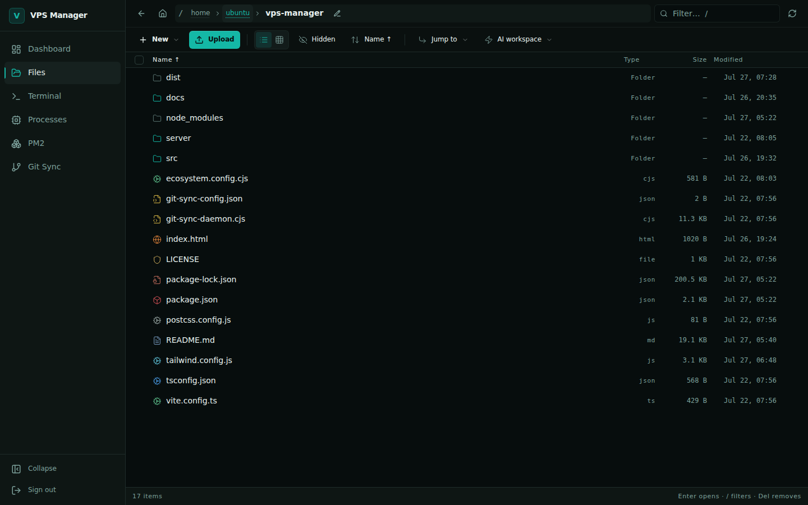

Path-jailed browsing across the allowed roots, in list or grid, sortable by name,
size, type or modified time. Shift-click ranges, a full keyboard map, and an
editable address bar (`Ctrl+L`) for typing or pasting a path.

Per-type icons give every language family its own glyph *and* hue, with
exact-filename overrides for `package.json`, `Dockerfile`, `.gitignore` and lock
files — a directory of mixed sources is readable at a glance instead of being a
column of identical grey pages.

Uploads are multi-file with real progress and drag-and-drop; directories download
as ZIP. Inline previews cover images (zoom/rotate), audio, video and PDF.

### Editor

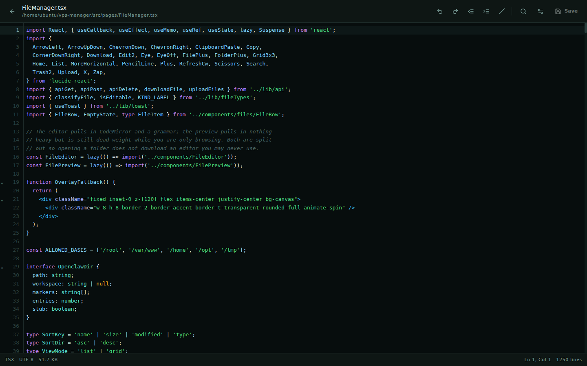

CodeMirror 6 with on-demand grammars for around 40 languages, loaded individually
— editing a `.sh` file never fetches the TypeScript parser.

CodeMirror rather than Monaco specifically because of phones. Monaco renders text
into a positioned overlay backed by a hidden textarea, so a mobile OS never sees a
real editable region: no selection handles, no caret magnifier, and a virtual
keyboard that fights the scroll model. CodeMirror is `contenteditable`, so
selection, caret and IME are handled natively.

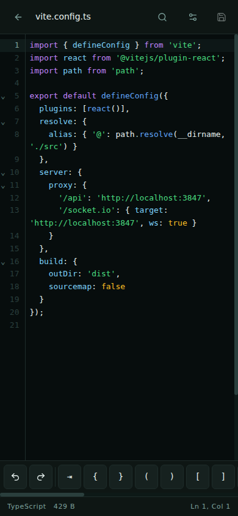

### Terminal

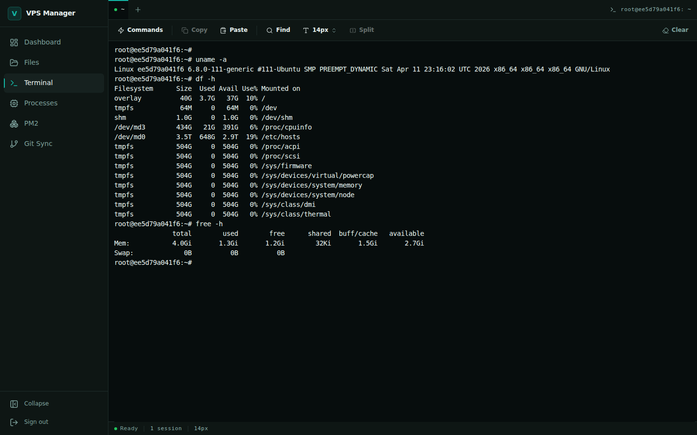

Real PTY sessions, multiple tabs, split panes on desktop. Shells start in the
effective user's actual home directory, and the shell environment is isolated from
the panel's own — `PASSWORD`, `JWT_SECRET` and `PORT` never leak into a session.

The mobile key bar carries the 24 characters a phone keyboard cannot produce:
`Ctrl`, `Alt`, `Esc`, `Tab`, arrows, `^C`/`^D`/`^L` and shell punctuation. Sticky
modifiers are shared with the device keyboard, so `Ctrl`+`C` works when you tap
`Ctrl` and then type `c` on the phone's own keys.

The layout tracks the VisualViewport API rather than `100dvh`, because `dvh` does
not shrink for an on-screen keyboard — the key bar would slide underneath it
exactly when you started typing.

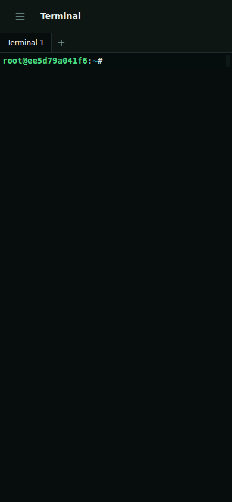

### Processes and PM2

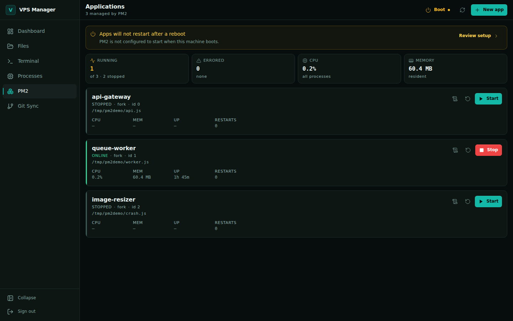

A live `ps`-backed table sortable on PID, CPU, memory and command, with signal
selection when terminating.

For PM2: the full lifecycle, live log streaming with search, per-app metrics, and
a four-step wizard for new apps where only the name is required — memory limits,
scheduled restarts, node arguments and environment variables sit behind an
Advanced drawer that reports how many are set. Stopped apps show `—` rather than
counting uptime upward from a stale timestamp.

### Git

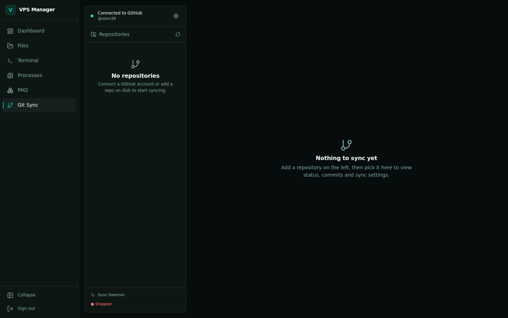

Repository discovery with status, branch and history. Stage, commit, pull, push,
discard, checkout; branches and tags; stash push/pop; merge with conflict status
and abort. GitHub is set up through a generated deploy key, and a background
daemon can sync per-repo.

### Dashboard

Live CPU, memory, disk and network over Socket.IO, with a rolling 60-sample
history and auto-scaled sparklines. Load average is shown against core count.

Metric tiles stay neutral until a threshold is actually crossed, so an idle server
looks calm and a struggling one is obvious. Colour means state and nothing else;
the accent colour means "you can interact with this" and nothing else.

### On a phone

<div align="center">
  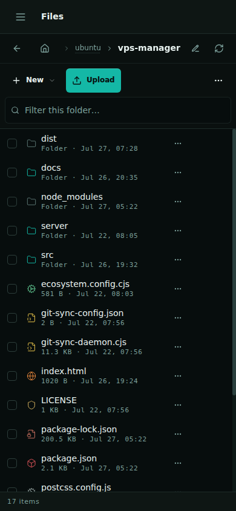
  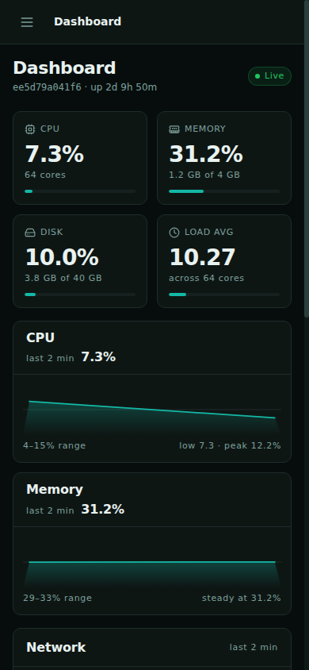
  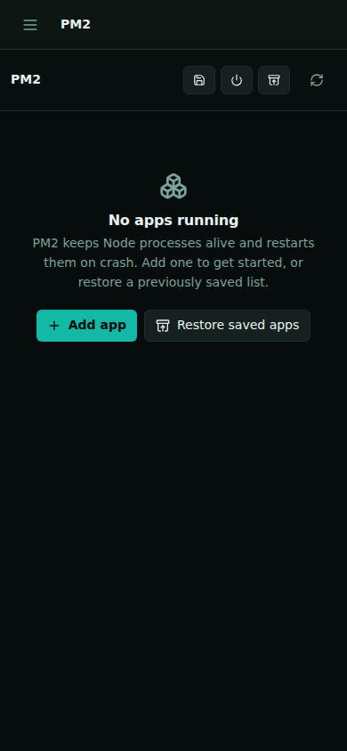
</div>

---

## Sessions

You stay signed in for 30 days, and long editing sessions are never interrupted.

Earlier versions issued a single 30-minute JWT and never renewed it. Half an hour
into editing a file, the next save returned 401 and dropped you at the login form
with unsaved work. Simply lengthening that token would have traded an annoyance
for a much bigger XSS blast radius, so the fix was to split it:

| | Access token | Refresh token |
|---|---|---|
| Lifetime | 15 minutes | 30 days |
| Stored in | `localStorage` — readable by scripts | `httpOnly` cookie — **not** readable by scripts |
| Sent as | `Authorization: Bearer` | automatically, to `/api` only |
| Rotates | on every renewal | on every use |

The browser renews at about 80% of the access token's life, and again when the tab
regains focus or the network returns — background timers are throttled in hidden
tabs and frozen on sleeping phones, so a timer alone would not survive a closed
laptop lid. If a request still 401s, the client refreshes once and replays it;
concurrent 401s share a single refresh instead of stampeding.

Rotation makes replay detectable: presenting an already-spent token outside a
short grace window revokes every token descended from that login. The grace window
exists because two tabs refreshing at the same instant legitimately present the
same cookie, and logging someone out for using the app normally is not security.

Refresh tokens are stored only as SHA-256 hashes in `server/sessions.json` (mode
`0600`), so the file is not a set of usable credentials if it leaks. Sessions
survive a restart.

`POST /api/logout` revokes server-side. To end every session on every device —
after exposing the password, say — call `POST /api/sessions/revoke-all`, or delete
`server/sessions.json` and restart.

---

## Security

**Implemented:** timing-safe password comparison; rotating refresh tokens with
reuse detection and server-side revocation; login rate limiting with per-IP lockout
and automatic expiry; the filesystem path jail; `helmet` headers; an audit log at
`server/audit.log` covering auth, file operations and system actions; and no
credentials in URLs — downloads authenticate by header, so tokens never reach
access logs or `Referer`.

**Yours to provide:**

| Risk | Mitigation |
|---|---|
| Plain HTTP exposes the password and tokens | Terminate TLS in a proxy or tunnel |
| Panel reachable from the internet | Firewall the port; expose only via the proxy |
| Full shell access by design | Treat the password as root-equivalent |
| Access token sits in `localStorage` | It expires in 15 minutes, and the durable credential is the `httpOnly` cookie — but do not run untrusted scripts on this origin |

> **This panel grants terminal access to the host.** Anyone with the password
> effectively has the privileges of the user running the server. Never expose it
> to the public internet without TLS and network restrictions.

**On `npm audit`.** It reports 2 high advisories in `react-router`'s RSC server
mode, which this SPA does not use — not reachable here. Every version at or below
7.17.0 carries a *reachable* open-redirect/XSS pair instead, so 7.18.1 is the
safest available target. **Running `npm audit fix --force` downgrades you into the
exploitable versions.** The `archiver` chain is patched through pinned `overrides`
rather than a major bump, because `archiver` 8 is ESM-only and the server is
CommonJS.

---

## Architecture

The browser runs React 18 with route-level code splitting, talking to an Express
server over REST for actions and Socket.IO for anything live — metrics, PTY
streams, PM2 logs. The server shells out to `node-pty`, the PM2 CLI and the git
CLI, and everything is wrapped in helmet, rate limiting, the path jail and the
audit log.

| Layer | Technology |
|---|---|
| UI | React 18, React Router 7, Tailwind 3 |
| Editor / terminal | CodeMirror 6, xterm.js 5 |
| Build | Vite 6, TypeScript 5.6 |
| Server | Express 4, Socket.IO 4 |
| Process / PTY | node-pty, PM2 |
| Security | helmet, express-rate-limit, jsonwebtoken |

```
src/
├── components/   Layout shell, Footer, CodeEditor, FileEditor, FilePreview,
│                 TerminalPane, UpdateModal, pm2/, git-sync/, files/
├── lib/          api.ts (fetch + 401 replay), auth.ts (token lifecycle),
│                 socket.ts, update.ts, toast.tsx, fileTypes.ts, editor*.ts
├── pages/        Dashboard, FileManager, Terminal, Processes, PM2Manager,
│                 GitSync, Settings, Login
├── index.css     Design tokens and component primitives
└── App.tsx       Auth gate, error boundary, toasts, lazy routes

server/
├── index.cjs     Routes, Socket.IO, PTY, auth middleware
├── platform.cjs  Boot-time host detection (user, homes, init system, PM2_HOME)
├── sessions.cjs  Refresh-token store: rotation, reuse detection, revocation
└── updater.cjs   Update detection, config, and launching the runner

scripts/
├── update-runner.mjs  Performs an update: stage, verify, swap, restart, roll back
└── release.mjs        Version bump, tag and push
```

Pages are lazy-loaded, so xterm and the heavier managers are only fetched when
their route is visited. The editor splits out again below the route: browsing a
folder costs about 53 KB, and CodeMirror downloads only when you open a file.

---

## API

Everything requires `Authorization: Bearer <token>` except `POST /api/login`,
`POST /api/refresh` (which authenticates by cookie, since it must work once the
access token has expired) and `GET /api/update/status` (so the browser can confirm
the panel came back after a restart, when it may hold no valid token).

**Auth** — `POST /api/login` · `GET /api/verify` · `POST /api/refresh` ·
`POST /api/logout` · `GET /api/sessions` · `POST /api/sessions/revoke-all`

**System** — `GET /api/version` · `GET /api/system/info` · `GET /api/system/stats` ·
`POST /api/system/action/:action` · `GET /api/audit/logs`

**Updates** — `GET /api/update/check` · `GET|POST /api/update/config` ·
`POST /api/update/snooze` · `POST /api/update/skip` ·
`POST /api/update/reset-dismissals` · `POST /api/update/apply` ·
`GET /api/update/status` · `POST /api/update/status/clear`

**Files** — `GET /api/files/list` · `/content` · `/download` ·
`POST /api/files/save` · `/upload` · `/mkdir` · `/rename` · `/copy` ·
`DELETE /api/files/delete`

**Processes** — `GET /api/processes/list` · `POST /api/processes/kill`

**PM2** — `GET /api/pm2/list` · `/app-detail/:name` · `/logs/:name` · `/monit/:name` ·
`/boot-status` · `/browse-dirs` · `POST /api/pm2/restart` · `/reload` · `/delete` ·
`/flush` · `/reset`

**Git** — `GET /api/git/repos` · `/status` · `/info` · `/log` · `/diff` ·
`POST /api/git/stage` · `/commit` · `/pull` · `/push` · `/discard` · `/checkout` ·
branches, tags, stashes, merges under `/api/git/*` · `/api/git/github/*` for deploy
keys and cloning · `/api/git/sync/config` for the daemon

**WebSocket** — `stats:subscribe` / `stats:update` · `terminal:create` / `input` /
`resize` / `destroy` / `terminal:data` · `pm2:logs:subscribe`

`GET /api/version` reports a per-boot `bootId` and `pid` alongside the version, so
a surviving process can be told apart from a freshly restarted one. The updater
depends on that distinction: a stale server answers HTTP perfectly well and would
otherwise read as a successful update.

---

## Development

```bash
NODE_ENV=development npm install --include=dev

npm run server     # API + WebSocket on :48292
npm run dev        # Vite with HMR, proxying /api and /socket.io to it
```

| Script | Purpose |
|---|---|
| `npm run dev` | Frontend dev server with hot reload |
| `npm run server` | Backend only |
| `npm run build` | Production build into `dist/` |
| `npm run preview` | Serve the production build locally |
| `npm run release -- x.y.z` | Bump both version files, commit, tag, push |

**Vite does not type-check.** A green build says nothing about type safety, so run
it yourself — and use the local binary, since `npx tsc` installs an unrelated
package:

```bash
./node_modules/.bin/tsc --noEmit
```

The panel serves `dist/`, so a frontend change is live as soon as `vite build`
finishes. Only server changes need a restart.

Colours, type scale and radii live in `tailwind.config.js`; the component
primitives (`.card`, `.btn`, `.pill`, `.row`, `.field`, `.empty`) live in
`src/index.css`. Prefer them over ad-hoc utility strings so restyling stays a
one-file change instead of a find-and-replace across thousands of lines.

---

## Troubleshooting

| Symptom | Cause | Fix |
|---|---|---|
| `vite: not found` when building | `NODE_ENV=production` made npm skip devDependencies | `NODE_ENV=development npm install --include=dev` |
| Server exits complaining about `PASSWORD` | Missing or unreadable `.env` | Create `.env` in the project root |
| Terminal never connects | The proxy is dropping the WebSocket upgrade | Add the `Upgrade` / `Connection` headers |
| `node-pty` fails to install | No native build toolchain | `apt install build-essential python3` |
| PM2 page empty | PM2 not installed for the server's user | `npm i -g pm2`, and check `pm2 list` works as that user |
| Locked out after failed logins | Per-IP lockout | Wait for expiry, or restart the server |
| Signed out after ~15 minutes | The refresh cookie is not reaching the server | It is scoped to `/api` and `SameSite=Strict` — confirm the proxy forwards cookies and does not strip `Set-Cookie`, and use one consistent origin |
| Signed out switching `http://` ↔ `https://` | The cookie's `Secure` flag follows the protocol it was issued on | Pick one origin and stay on it |
| Everyone signed out after a redeploy | `JWT_SECRET` changed | Keep it stable across deploys; sessions themselves survive restarts |
| Update refuses: "working tree has uncommitted changes" | Real local edits, by design | Commit or discard them. If you never edited anything, check that `package.json` and `package-lock.json` agree on the version |
| Update ran but the version did not change | The restart did not take effect | Check `GET /api/version` for a new `bootId`; the panel rolls back automatically if the new build does not answer |

---

MIT — see [LICENSE](./LICENSE).

<div align="center">
<sub>Built by <a href="https://github.com/siam38">Siam</a></sub>
</div>
